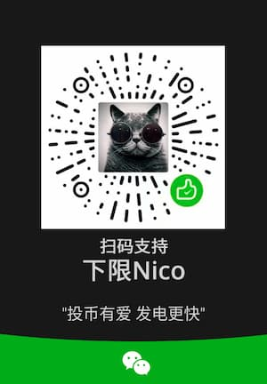

**原神钓鱼自动人偶**  
**Genshin Impact Fishing Automata**

## Video 视频
- Bilibili (Zh): https://www.bilibili.com/video/BV1pq4y1f7V2/
- Youtube (En): https://www.youtube.com/watch?v=3lvCEh7quxE

## Communities 社群
- 开黑啦(中国大陆): https://kaihei.co/IWXRLp
- Discord(Global): https://discord.gg/5PCebykNaC

## Related Repo 相关项目
- DoMiSo-Genshin(原神自动弹琴人偶): https://github.com/Nigh/DoMiSo-genshin
- LyreMaster-Genshin(原神手搓弹琴大师): https://github.com/Nigh/LyreMaster-Genshin

## Download(下载)

- [GitHub Download - GitHub下载](https://github.com/Nigh/Genshin-fishing/releases/latest/download/GenshinFishing.zip)
- [Mirror Download - 镜像下载](https://mirror.ghproxy.com/https://github.com/Nigh/Genshin-fishing/releases/latest/download/GenshinFishing.zip)

## Usage 用法用量
解压到文件夹，直接运行exe即可。  
Unzip it into a folder and run the exe directly.

软件更新需要先关闭软件。如果没有自动关闭，右键任务栏小图标即可关闭。  
Software update needs to close the software first. If it does not close automatically, right-click the small icon in the taskbar to close.

以下图像设置已经测试可以正常工作：  
The following image settings have been tested to work properly:

| 分辨率 Resolution | 支持 Support |
| ----------------- | ------------ |
| 3840 x 2160       | ✔            |
| 3440 x 1440       | ✔            |
| 1920 x 1200       | ✔            |
| 1920 x 1080       | ✔            |
| 2560 x 1600       | ✔            |
| 2560 x 1440       | ✔            |
| 2560 x 1080       | ✔            |
| 1600 x 900        | ✔            |
| 1440 x 900        | ✔            |
| 1280 x 720        | ✔            |

如果需要更多的分辨率支持，请提交issue。  
If you need more resolutions support, please submit an issue.

因个人精力有限，非常规尺寸的分辨率将不予支持。  
Due to limited spare time, resolutions of unconventional sizes will not be supported. 

### Setting.ini

Tooltip messages are turned off by default, specify `debug=1` in `setting.ini` to turn on

提示信息默认关闭，在`setting.ini`中指定`debug=1`开启

specify `log=1` or `log=2` in `setting.ini` to start logs with different levels of detail and save them in the genshinfishing.log file

在`setting.ini`中指定`log=1`或`log=2`启动不同详细程度的log，保存在genshinfishing.log文件中

You can turn off automatic updates by specifying `autoupdate=0` in `setting.ini`

在`setting.ini`中可以指定`autoupdate=0`来关闭自动更新

### 性能 Performance

- CPU: AMD R5 3600
- GPU: GTX1060
- Res: `1920`x`1080`

在以上配置下，目前单帧画面的检测用时为 `25ms`  
Under the above hardware configuration, the current detection time for a single frame is `25ms`.

### Donate(捐助)

| Platform |                          Donate                          |
| :------: | :------------------------------------------------------- |
|  Ko-fi   | https://ko-fi.com/xianii                                 |
|  Paypal  | https://paypal.me/xianii                                 |
|  爱发电  | https://afdian.net/a/xianii                              |
|   微信   |  |
|  支付宝  |  |

## Stargazers over time

## For developers

Since this script is designed to run after being compiled into a binary. So you can not simply run the `GenshinFishing.ahk`. 

You should run `dist.ahk` at fisrt, which will automatically generate a fileinstalls file and compile it into binary. Running the compiled binary is necessary to correctly release the assets files into the temporary directory.
